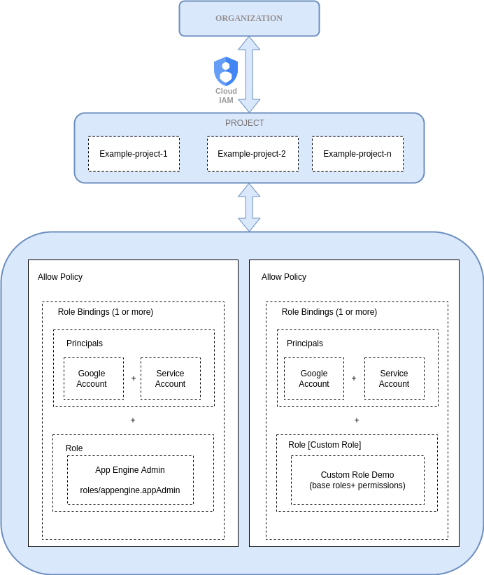

## Google IAM Terraform Module
This is a collection of submodules that helps in managing multiple IAM roles for resources on Google Cloud Platform.

## Requirements

- Terraform plugins
- terraform-provider-google
- terraform-provider-google-beta 
## Cloud IAM implementation flow
Below diagram explains the Project level IAM :

## Usage
Full examples are in the **"examples"** folder.Go to each module under **"examples"** folder and execute the steps mentioned in each module.
<pre>
|---- examples
       |----custom_role_project
       |----member_iam_service_account
       |----project
       |----project_conditions
|---- modules
       |----custom_role_iam
       |----helper
       |----member_iam
       |----projects_iam
</pre>